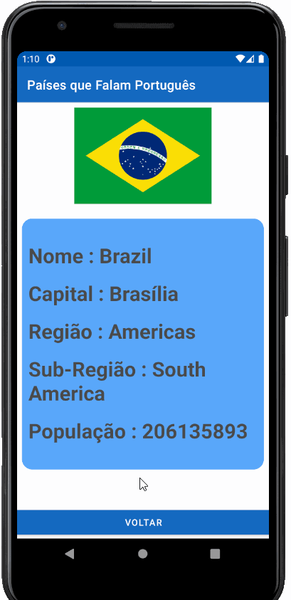

#Aplicativo Paises Falantes da Língua Portuguesa

App desenvolvido em java para desenvolvimento Android, que obtém informações de países falantes da língua portuguesa, acessando a api do site restcountries.eu
